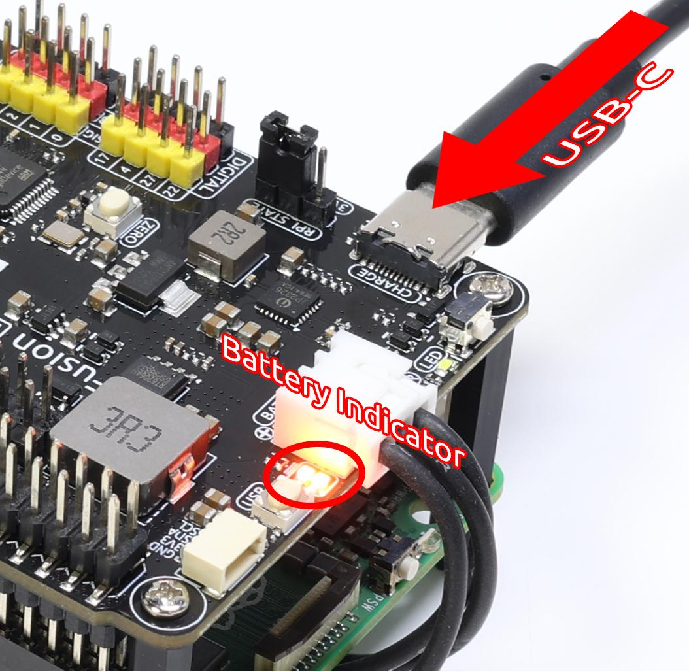
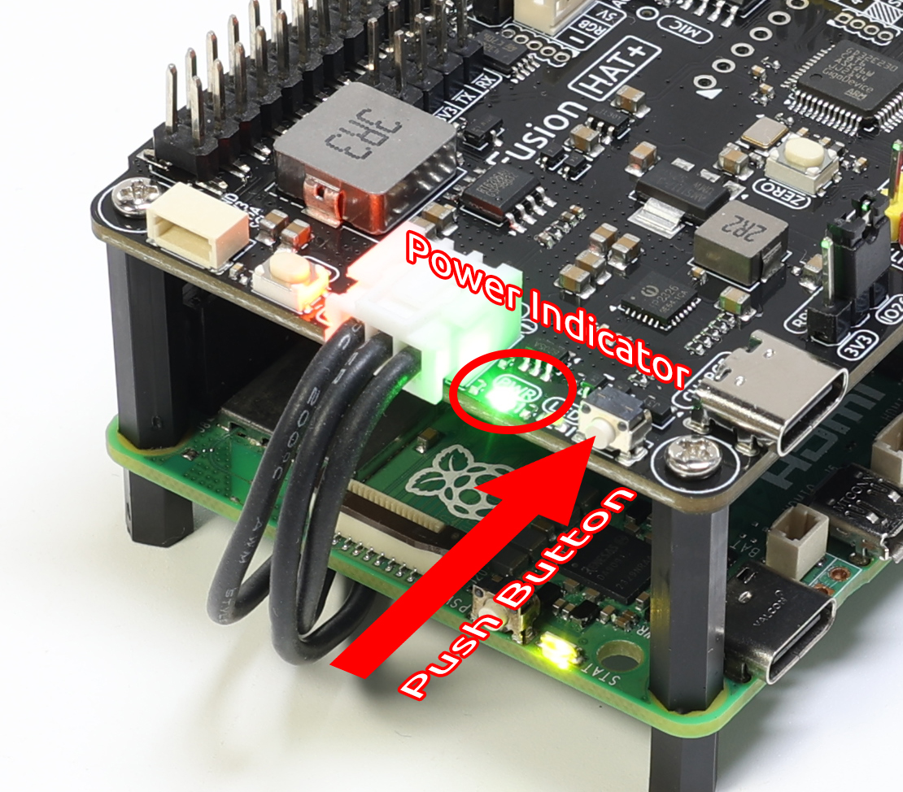

.. _assemble_hat:

Assemble and Power on Fusion HAT (Important)
=======================================================

Connect Fusion HAT to Raspberry Pi
----------------------------------------

Here, we'll teach you how to assemble the Fusion HAT.

#. Assemble the base.
#. Stick the battery to the base.
#. Secure the Raspberry Pi with with standoffs.
#. Connect the FPC cable to the Raspberry Pi. (We will assemble it and the Camera Module when assembled the pan-tilt.)
#. Plug the Fusion HAT into the 40-pin connector on the Raspberry Pi. 
#. **Insert the battery.** (This is very important. If you don't insert the battery, the Fusion HAT will not work.)

For the details of the assembly, please check the video below.

.. raw:: html

  <iframe width="560" height="315" src="https://www.youtube.com/embed/HlAayd1mSxU?si=oZnKyZihyyjQhsHl" title="YouTube video player" frameborder="0" allow="accelerometer; autoplay; clipboard-write; encrypted-media; gyroscope; picture-in-picture; web-share" referrerpolicy="strict-origin-when-cross-origin" allowfullscreen></iframe>

Charge
-------------------

Before the first use, it is recommended to fully charge the battery. You can use the included USB Type-C charging cable, or your own USB-C charger.  

.. note::

  The battery may arrive with low charge because Amazon requires it to be below 30% before air shipment. You **MUST** fully charge it before use to prevent over-discharge and damage.
  Plug the USB-C to Fusion HAT, and the battery will be charged automatically. You don't need to connect the power supply to the Raspberry Pi.

* We recommend using a **5V 3A power supply**, such as the official Raspberry Pi 15W adapter.  
* You can also use a **USB-C PD (Power Delivery)** charger or a **QC 2.0 fast charger**.  
* Charging from 0% to full typically takes about **2 hours**.  

The Fusion HAT includes **two battery indicator LEDs**, showing the battery voltage level:  

.. list-table::
   :header-rows: 1
   :widths: 40 40

   * - LED Status
     - Battery Voltage
   * - 2 LEDs ON
     - > 7.4V
   * - 1 LED ON
     - < 7.4V
   * - Both LEDs OFF
     - < 6.5V

When charging, one of the LEDs will blink to indicate charging progress:  

.. list-table::
   :header-rows: 1
   :widths: 40 40

   * - LED Status
     - Battery Voltage
   * - 1 LED ON, 1 LED Blinking
     - > 7.4V
   * - Only 1 LED Blinking
     - < 7.4V

After fully charged:

* **If the project is ON**, both LEDs will remain lit.  
* **If the project is OFF**, both LEDs will turn off.  

.. note::

   For extended programming or debugging sessions, you can keep the Fusion HAT powered  
   by connecting the USB-C cable, which will charge the battery and run the project at the same time. 
   Even if you run the project while the charer is connected, the battery **cannot** be removed.

Power ON
----------------------

When the battery has sufficient charge, press the **power button** on the Fusion HAT briefly. 

* The **PWR LED** will turn on.  
* The **battery LEDs** will also light up.  
* The Raspberry Pi will power on automatically.  

Assemble the Gimbal (For Camera Mount) 
------------------------------------------------------

.. note:: 
  
  Assembling the gimbal may obscure some pins, so it is recommended to assemble it only when using the camera, or place it on the outside after assembly.

For the details of the assembly, please check the video below.

.. raw:: html

  <iframe width="560" height="315" src="https://www.youtube.com/embed/mDCNKVzNLkg?si=2gYJ1feopWgglekR" title="YouTube video player" frameborder="0" allow="accelerometer; autoplay; clipboard-write; encrypted-media; gyroscope; picture-in-picture; web-share" referrerpolicy="strict-origin-when-cross-origin" allowfullscreen></iframe>