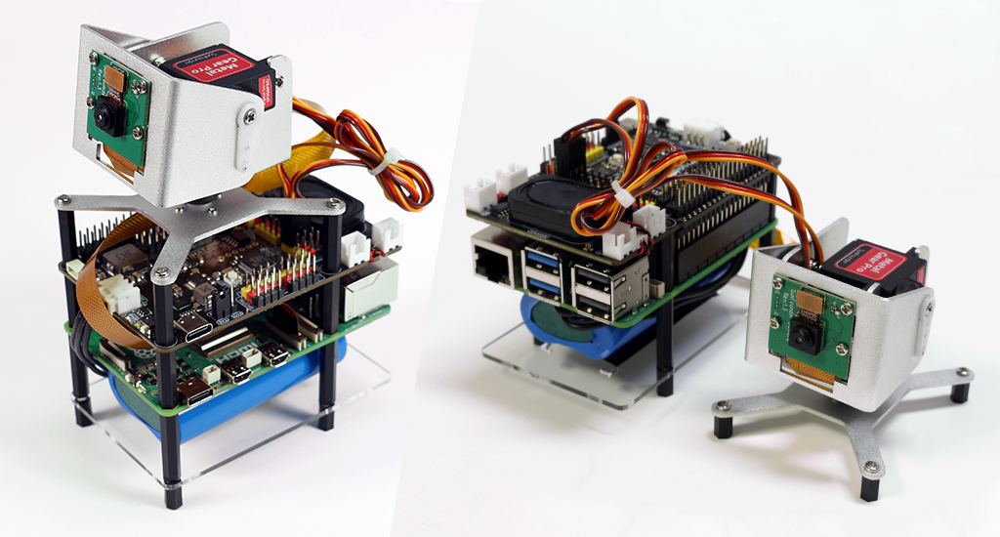

.. include:: /index.rst
   :start-after: start_hello_message
   :end-before: end_hello_message

.. _assemble_hat:

.. start_assemble_hat

Assemblare e Accendere Fusion HAT+ (Importante)
=======================================================

Collegare Fusion HAT+ al Raspberry Pi
----------------------------------------

Qui ti insegneremo come assemblare il Fusion HAT+.

#. Assembla la base.
#. Attacca la batteria alla base.
#. Fissa il Raspberry Pi con i distanziatori.
#. Collega il cavo FPC al Raspberry Pi. (Lo assembleremo insieme al modulo telecamera quando monteremo il pan-tilt.)
#. Inserisci il Fusion HAT+ nel connettore a 40 pin del Raspberry Pi.
#. **Inserisci la batteria.** (Questo e' molto importante. Se non inserisci la batteria, il Fusion HAT+ non funzionera'.)

Per i dettagli dell'assemblaggio, guarda il video qui sotto.

.. raw:: html

  <iframe width="100%"
    style="aspect-ratio: 16/9; max-width: 100%;"
    src="https://www.youtube.com/embed/HlAayd1mSxU?si=oZnKyZihyyjQhsHl"
    title="YouTube video player"
    frameborder="0"
    allow="accelerometer; autoplay; clipboard-write; encrypted-media; gyroscope; picture-in-picture; web-share"
    allowfullscreen>
    </iframe>

Carica
-------------------

Prima del primo utilizzo, si consiglia di caricare completamente la batteria. Puoi utilizzare il cavo di ricarica USB Type-C incluso o un tuo caricabatterie USB-C.

.. note::

  La batteria potrebbe arrivare con carica bassa perche' Amazon richiede che sia al di sotto del 30% prima del trasporto aereo. **DEVI** caricarla completamente prima dell'uso per prevenire scariche eccessive e danni.
  Collega il USB-C al Fusion HAT+ e la batteria si carichera' automaticamente. Non e' necessario collegare l'alimentazione al Raspberry Pi.

* Raccomandiamo l'uso di un **alimentatore 5V 3A**, come l'adattatore ufficiale Raspberry Pi 15W.
* Puoi anche usare un caricabatterie **USB-C PD (Power Delivery)** o un **caricabatterie rapido QC 2.0**.
* La ricarica dallo 0% al completo richiede tipicamente circa **2 ore**.

.. image:: img/power_charge.jpg
   :width: 400
   :align: center

Il Fusion HAT+ include **due LED indicatori della batteria**, che mostrano il livello di tensione della batteria:

.. list-table::
   :header-rows: 1
   :widths: 40 40

   * - Stato LED
     - Tensione Batteria
   * - 2 LED ACCESI
     - > 7.4V
   * - 1 LED ACCESO
     - < 7.4V
   * - Entrambi i LED SPENTI
     - < 6.5V

Durante la ricarica, uno dei LED lampeggia per indicare lo stato di avanzamento:

.. list-table::
   :header-rows: 1
   :widths: 40 40

   * - Stato LED
     - Tensione Batteria
   * - 1 LED ACCESO, 1 LED LAMPEGGIANTE
     - > 7.4V
   * - Solo 1 LED LAMPEGGIANTE
     - < 7.4V

Dopo la carica completa:

* **Se il Fusion HAT+ e' ACCESO**, entrambi i LED rimarranno accesi.
* **Se il Fusion HAT+ e' SPENTO**, entrambi i LED si spegneranno.

.. note::

   Per sessioni di programmazione o debug prolungate, puoi mantenere il Fusion HAT+ alimentato
   collegando il cavo USB-C, che carichera' la batteria e fara' funzionare il Fusion HAT+ contemporaneamente.
   Anche se fai funzionare il Fusion HAT+ mentre il caricabatterie e' collegato, la batteria **non puo'** essere rimossa.

Accensione
----------------------

Quando la batteria ha carica sufficiente, premi brevemente il **pulsante di accensione** sul Fusion HAT+.

* Il **LED PWR** si accendera'.
* I **LED della batteria** si accenderanno anch'essi.
* Il Raspberry Pi si accendera' automaticamente.

.. image:: img/power_button.jpg
    :width: 400

.. end_assemble_hat

.. _assemble_fusion_hat_pan_tilt:

Assemblare il Pan-tilt (Per la Telecamera)
------------------------------------------------------

Per facilitare l'uso del modulo telecamera, puoi assemblare un pan-tilt.

.. note::

  L'assemblaggio del pan-tilt potrebbe oscurare alcuni pin, quindi si consiglia di assemblarlo solo quando si utilizza la telecamera, o posizionarlo all'esterno dopo l'assemblaggio.

Per i dettagli dell'assemblaggio, guarda il video qui sotto.

.. raw:: html

  <iframe width="100%"
    style="aspect-ratio: 16/9; max-width: 100%;"
    src="https://www.youtube.com/embed/7CkGPKnbjM4"
    title="YouTube video player"
    frameborder="0"
    allow="accelerometer; autoplay; clipboard-write; encrypted-media; gyroscope; picture-in-picture; web-share"
    allowfullscreen>
    </iframe>
