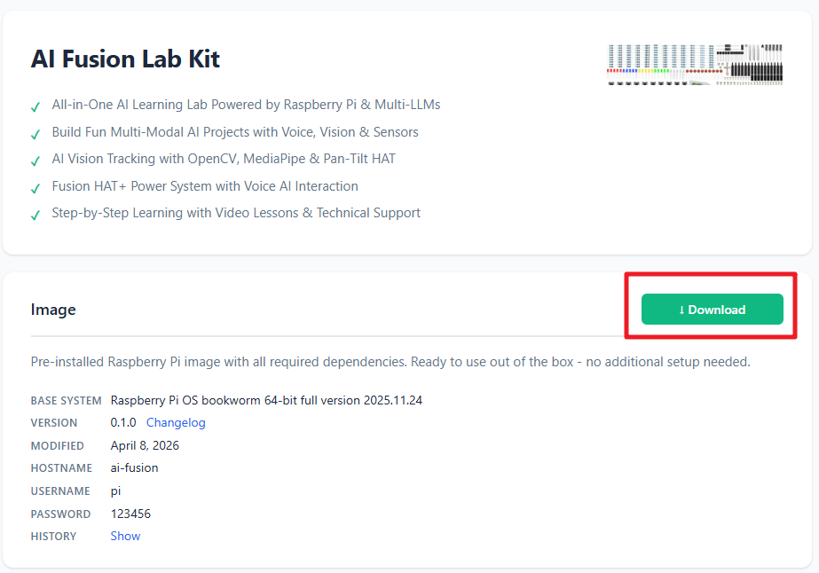

.. include:: /index.rst
   :start-after: start_hello_message
   :end-before: end_hello_message

.. _install_os_sd_fusion_kit:

Installing the Operating System
===================================

.. include:: /_shared/pi_start/install_os_trixie.rst
   :start-after: start_imager
   :end-before: end_imager

Download the Exclusive Image File
------------------------------------------------------

Download the AI ​​Fusion Lab Kit operating system image file: `Raspberry Pi OS with AI Fusion Lab Kit <https://sunfounder.github.io/download/ai-fusion-lab-kit/index.html>`_。 

This image is based on Raspberry Pi OS and comes with the AI Fusion Lab Kit pre-integrated into the system. It includes all the necessary software, example code, and related configurations required for the AI Fusion Lab Kit. By using this image, you can skip certain setup steps described in the documentation.

If you prefer to use a native Raspberry Pi OS for manual configuration, please install:  
`Raspberry Pi OS (Legacy, 64-bit) (Bookworm, Debian 12)`

.. include:: /_shared/pi_start/install_os_trixie.rst
   :start-after: start_install_os
   :end-before: end_install_os

3. Go to the OS section and choose the **Use custom** 
   
   .. image:: img/fusion_kit_imager1.png
      :width: 90%

   And select the downloaded image file ``ai.fusion.lab.kit-bookworm.64.full.20xx.xx.xx-latest.zip``.

   .. image:: img/fusion_kit_imager2.png
      :width: 90%

.. include:: /_shared/pi_start/install_os_trixie.rst
   :start-after: start_storage
   :end-before: end_storage

.. .. include:: /_shared/pi_start/install_os_trixie.rst
..    :start-after: start_cutomization_os
..    :end-before: end_cutomization_os

.. include:: /_shared/pi_start/install_os_trixie.rst
   :start-after: start_write_os
   :end-before: end_write_os
