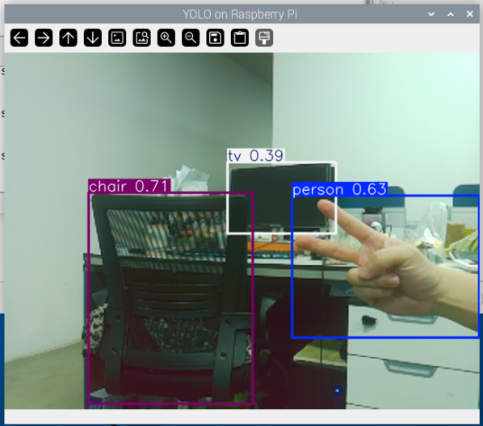

.. include:: /index.rst
   :start-after: start_hello_message
   :end-before: end_hello_message

1. 在Raspberry Pi上运行YOLO
==============================================================

YOLO（You Only Look Once）是一种革命性的目标检测算法，以其速度和准确性著称。它将目标检测转化为回归问题，通过单次神经网络前向传播即可预测图像中所有物体的类别和位置。

可以将其想象为一个能够"一眼看尽所有"的视觉系统。无论是视频监控、自动驾驶还是工业质检，只要需要实时目标检测，都能看到YOLO的身影。

图示：YOLOv8n在Raspberry Pi上实时运行。摄像头画面中的物体被准确检测并标注，左侧显示检测到的类别和置信度分数。本图展示模型成功识别了人、椅子和电视等物体。

核心原理
------------------------------------------

与早期两阶段方法（如R-CNN）"先找候选区域再识别"不同，YOLO采用了一种根本不同的方法：

* **统一框架**：将图像划分为网格（例如原始的7x7网格）。

* **网格预测**：每个网格单元负责预测中心落在该单元内的物体。每个网格预测多个边界框（包括位置和大小）及其置信度分数，同时预测物体类别概率。

* **一步完成**：分类和定位在同一神经网络中同时完成，真正实现"只看一次"，因此在速度上远超此前的方法。

运行代码
------------------------------------

.. code-block:: bash

   cd ~/ai-lab-kit/yolo
   python3 yolo_test.py

代码将自动下载模型（约6MB）并在摄像头上运行，结果将在一个标题为"YOLOv8"的窗口中显示。

（首次运行将自动下载约6MB的模型）：

.. code-block:: python

   #!/usr/bin/env python3
   import cv2
   from picamera2 import Picamera2
   from ultralytics import YOLO

   model = YOLO("yolov8n.pt")  # nano model

   # initialize camera
   picam2 = Picamera2()
   picam2.preview_configuration.main.size = (640, 480)
   picam2.preview_configuration.main.format = "RGB888"
   picam2.configure("preview")
   picam2.start()

   print("YOLO start, Press 'q' to exit...")

   try:
      while True:
         # capture frame
         frame = picam2.capture_array()

         # run YOLO and set imgsz=320
         results = model(frame, imgsz=320)

         # draw results
         annotated = results[0].plot()

         # show results
         cv2.imshow("YOLO on Raspberry Pi", annotated)

         # press 'q' to exit
         if cv2.waitKey(1) & 0xFF == ord('q'):
               break
   finally:
      cv2.destroyAllWindows()
      picam2.stop()
      print("exit")

故障排除
---------------

问：遇到Numpy.dtype size changed错误
~~~~~~~~~~~~~~~~~~~~~~~~~~~~~~~~~~~~~~~~~~~~~~~~~~~~~~~~~~~~

降级Numpy版本：

.. code-block:: bash

   # If version is 2.x, downgrade to 1.x
   pip3 install "numpy<2.0" --break-system-packages --force-reinstall

问：遇到\ ``libopenblas.so.0``\ 缺失错误
~~~~~~~~~~~~~~~~~~~~~~~~~~~~~~~~~~~~~~~~~~~~~~~~~~~~~~~~~~~~~~~~~~~~~~~

安装OpenBLAS库：

.. code-block:: bash

   sudo apt install libopenblas-dev

问：无法打开摄像头
~~~~~~~~~~~~~~~~~~~~~~~~~~~~~~~~~~~~~~~~~~~~~~~~

检查摄像头连接并确保已启用：

.. code-block:: bash

   sudo raspi-config
   # Select Interface Options -> Camera -> Enable

问：遇到内存不足错误
~~~~~~~~~~~~~~~~~~~~~~~~~~~~~~~~~~~~~~~~~~~~~~~~

增加交换空间：

.. code-block:: bash

   sudo dphys-swapfile swapoff
   sudo nano /etc/dphys-swapfile
   # Modify CONF_SWAPSIZE=2048
   sudo dphys-swapfile setup
   sudo dphys-swapfile swapon

性能优化方法
--------------------------------------------------------

在Raspberry Pi（即使是4B/5）上运行YOLO可能会有较大负担。以下是几种经过验证的优化方法：

1. **调整YOLO推理分辨率**：上述代码已使用imgsz=320，这是一个平衡的设置。可调值：

   * ``imgsz=224`` - 最低分辨率，最快速度
   * ``imgsz=320`` - 标准选择
   * ``imgsz=416`` - 更高精度，较慢速度
   * ``imgsz=640`` - 最高精度，在Raspberry Pi上非常慢

2. **选择合适的模型**：

   * ``yolov8n.pt`` (6MB) - 最快，适合实时检测
   * ``yolov8s.pt`` (22MB) - 稍慢但更精确
   * ``yolov8m.pt`` (49MB) - 更慢，精度更高
   * ``yolov8l/x.pt`` - 通常在Raspberry Pi上无法使用
   * 也可以使用自己训练的模型，例如\ ``"/home/pi/my_model.pt"``。我们将在后续章节介绍如何训练自定义模型。

3. **限制检测类别**：如果只检测特定物体（例如只检测人），修改代码：

.. code-block:: python

   results = model(frame, classes=[0], imgsz=320)  # 0 is the class ID for person

常见类别ID：

   * 0 - person（人）
   * 1 - bicycle（自行车）
   * 2 - car（汽车）
   * 3 - motorcycle（摩托车）
   * 5 - bus（公交车）
   * 7 - truck（卡车）

4. **使用轻量级模型变体**：

.. code-block:: python

   # Use pruned version of YOLOv8n (if available)
   model = YOLO("yolov8n.pt")

   # Or use TensorRT acceleration (requires additional configuration)
   # model = YOLO("yolov8n.pt")
   # model.export(format="engine")  # Export as TensorRT engine

5. **减少帧处理频率**：如果不需要实时显示所有帧，可以间歇处理：

.. code-block:: python

   frame_count = 0
   while True:
       frame = picam2.capture_array()

       # Process every 3rd frame
       if frame_count % 3 == 0:
           results = model(frame, imgsz=320)
           annotated = results[0].plot()
           cv2.imshow("YOLO on Raspberry Pi", annotated)

       frame_count += 1

       if cv2.waitKey(1) & 0xFF == ord('q'):
           break

6. **使用多线程**：将摄像头捕获和YOLO推理分到不同线程：

.. code-block:: python

   import threading
   import queue

   frame_queue = queue.Queue(maxsize=2)
   result_queue = queue.Queue(maxsize=2)

   def capture_frames():
       while True:
           frame = picam2.capture_array()
           if frame_queue.full():
               frame_queue.get()
           frame_queue.put(frame)

   def process_frames():
       while True:
           frame = frame_queue.get()
           results = model(frame, imgsz=320)
           annotated = results[0].plot()
           if result_queue.full():
               result_queue.get()
           result_queue.put(annotated)

   # Start threads
   threading.Thread(target=capture_frames, daemon=True).start()
   threading.Thread(target=process_frames, daemon=True).start()

   while True:
       if not result_queue.empty():
           cv2.imshow("YOLO on Raspberry Pi", result_queue.get())
       if cv2.waitKey(1) & 0xFF == ord('q'):
           break

高级用法
--------------------------------

使用视频文件作为输入
~~~~~~~~~~~~~~~~~~~~~~~~~~~~~~~~~~~~~

.. code-block:: python

   import cv2
   from ultralytics import YOLO

   model = YOLO("yolov8n.pt")
   cap = cv2.VideoCapture("input_video.mp4")

   while cap.isOpened():
       ret, frame = cap.read()
       if not ret:
           break

       results = model(frame, imgsz=320)
       annotated = results[0].plot()
       cv2.imshow("YOLO Detection", annotated)

       if cv2.waitKey(1) & 0xFF == ord('q'):
           break

   cap.release()
   cv2.destroyAllWindows()

总结
------------------

通过本教程，您已学会：

* 如何在Raspberry Pi上搭建YOLO环境
* 如何使用摄像头进行实时目标检测
* 如何解决常见的安装和运行问题
* 多种优化检测性能的方法

YOLO的优势在于其简洁和高效，即使在Raspberry Pi这样的嵌入式设备上也能实现可观的目标检测性能。继续探索，您可以构建各种有趣的应用，如智能监控、物体追踪和人员计数。