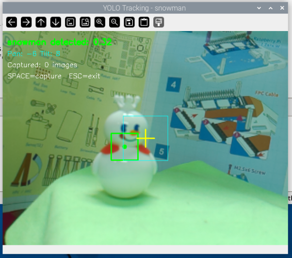

.. include:: /index.rst
   :start-after: start_hello_message
   :end-before: end_hello_message

4. Tracciare Oggetti con il Pan-Tilt
===============================================================

Nei tutorial precedenti, abbiamo imparato come utilizzare YOLO per il rilevamento oggetti su Raspberry Pi. Tuttavia, il rilevamento è solo il primo passo—se vuoi che la fotocamera "segua" realmente il bersaglio, devi combinare il rilevamento con il controllo meccanico.

Questo tutorial ti guiderà nella costruzione di un **Sistema di Tracciamento Oggetti YOLO** che realizza quanto segue:

* Rilevamento in tempo reale di oggetti specifici utilizzando YOLO
* Calcolo automatico della deviazione della posizione del bersaglio nel fotogramma
* Pan-tilt della fotocamera controllato da servo per mantenere il bersaglio centrato nel fotogramma
* Supporto per salvare i fotogrammi correnti con il tasto SPACE per la raccolta di dataset

Qui tracciamo il bersaglio dal nostro modello personalizzato addestrato nel tutorial precedente—il mio è un pupazzo di neve. Puoi anche scegliere altri modelli (come yolov8n) per tracciare altri bersagli (come persone, auto, ecc.).

Figura: Sistema di tracciamento oggetti YOLO in azione. Quando il bersaglio si muove, il pan-tilt della fotocamera segue automaticamente, mantenendo il bersaglio vicino al mirino giallo al centro del fotogramma. Il riquadro verde delimita il bersaglio rilevato.

**Scenari Applicativi**:

* Sorveglianza intelligente: Tracciare automaticamente bersagli sospetti
* Compagno per animali: Far seguire alla fotocamera i movimenti del tuo animale domestico
* Videoconferenze: Mantenere automaticamente gli oratori centrati nel fotogramma
* Raccolta dati: Acquisire automaticamente immagini multi-angolazione dei bersagli

Configurazione Hardware
---------------------------------------

Per utilizzare questo progetto, devi assemblare il pan-tilt seguendo le istruzioni in :ref:`assemble_fusion_hat_pan_tilt`.

.. image:: ../quick_start/img/gimbal_assemble.png

Esecuzione del Codice
----------------------------------------

1. **Modificare i parametri di configurazione**

   .. code-block:: bash

      cd ~/ai-lab-kit/yolo
      nano yolo_tracking.py

   Cambiare la variabile ``TARGET`` all'inizio del codice con l'oggetto che si desidera tracciare:

   .. code-block:: python

      TARGET = "person"     # Track a person
      # or
      TARGET = "snowman"    # Track a snowman

2. **Preparare il file del modello**

   * Usare un modello pre-addestrato: ``model = YOLO("yolov8n.pt")``
   * Usare un modello personalizzato: ``model = YOLO("snowman.pt")``

3. **Salvare ed eseguire il codice**

   .. code-block:: bash

      python3 yolo_tracking.py

4. **Istruzioni operative**

   * Dopo aver avviato il programma, la fotocamera inizia a funzionare automaticamente
   * Quando viene rilevato un bersaglio, i servo ruotano automaticamente per mantenere il bersaglio centrato nel fotogramma
   * Premere ``SPACE`` per salvare il fotogramma corrente (per la raccolta di dati di training)
   * Premere ``ESC`` per uscire dal programma

Codice
-----------------

.. code-block:: python

   #!/usr/bin/env python3
   """
   YOLO-based Object Tracking for Raspberry Pi
   Tracks a specific object (e.g., person) using YOLO and controls servos
   Press SPACE to capture images for dataset, ESC to exit
   """

   from picamera2 import Picamera2
   from ultralytics import YOLO
   from fusion_hat.servo import Servo
   import cv2
   import time
   import os

   # -------------------- Configuration --------------------
   TARGET = "your_object"      # Object to track (class name)
   W, H = 640, 480         # Camera resolution
   CX, CY = W // 2, H // 2 # Center coordinates
   CONFIDENCE = 0.3        # Detection confidence threshold
   DEADZONE = 50           # Pixels from center before moving
   SAVE_DIR = "captured_images"  # Dataset save directory

   # Create save directory
   os.makedirs(SAVE_DIR, exist_ok=True)

   print(f"=== YOLO Tracking System ===")
   print(f"Target: {TARGET}")
   print(f"Confidence threshold: {CONFIDENCE}")
   print(f"Deadzone: {DEADZONE} pixels")

   # -------------------- Servo Initialization --------------------
   print("Initializing servos...")
   pan = Servo(2)    # Channel 2 for pan (horizontal)
   tilt = Servo(3)   # Channel 3 for tilt (vertical)
   pan.angle(0)      # Center position
   tilt.angle(0)     # Center position
   time.sleep(1)

   # -------------------- YOLO Model Loading --------------------
   print("Loading YOLO model...")
   # Use YOLOv8n for best performance on Raspberry Pi
   model = YOLO("your_model.pt")
   print("Model loaded successfully")

   # -------------------- Camera Initialization --------------------
   print("Initializing camera...")
   picam2 = Picamera2()
   picam2.preview_configuration.main.size = (W, H)
   picam2.preview_configuration.main.format = "RGB888"
   picam2.configure("preview")
   picam2.start()
   time.sleep(2)

   print("\n=== System Ready ===")
   print("Controls:")
   print("  SPACE - Capture image (for dataset)")
   print("  ESC   - Exit")
   print("  (Auto-tracks object when detected)")
   print("==========================\n")

   # -------------------- Tracking Variables --------------------
   pan_pos = 0    # Current pan angle (-90 to 90)
   tilt_pos = 0   # Current tilt angle (-45 to 45)
   capture_count = 0

   def simple_track(x, y):
      """
      Simple 4-direction tracking with deadzone
      Returns: (pan_move, tilt_move) where:
         pan_move: -1 (left), 0 (stop), 1 (right)
         tilt_move: -1 (down), 0 (stop), 1 (up)
      """
      if x is None or y is None:
         return 0, 0
      
      pan_move = 0
      tilt_move = 0
      
      # Horizontal movement (pan)
      if x < CX - DEADZONE:
         pan_move = 1           # Move right
      elif x > CX + DEADZONE:
         pan_move = -1          # Move left
      
      # Vertical movement (tilt)
      if y < CY - DEADZONE:
         tilt_move = -1         # Move down
      elif y > CY + DEADZONE:
         tilt_move = 1          # Move up
      
      return pan_move, tilt_move

   def find_target_detection(results, target_name):
      """
      Search YOLO detection results for target object
      Returns: (x_center, y_center, confidence) or (None, None, None)
      """
      if len(results[0].boxes) == 0:
         return None, None, None
      
      for box in results[0].boxes:
         class_id = int(box.cls[0])
         class_name = model.names[class_id]
         confidence = float(box.conf[0])
         
         # Case-insensitive partial match
         if target_name.lower() in class_name.lower():
               x1, y1, x2, y2 = box.xyxy[0].cpu().numpy()
               x_center = int((x1 + x2) / 2)
               y_center = int((y1 + y2) / 2)
               return x_center, y_center, confidence
      
      return None, None, None

   # -------------------- Main Tracking Loop --------------------
   try:
      while True:
         # Capture frame
         frame = picam2.capture_array()
         
         # Run YOLO detection
         results = model.predict(frame, imgsz=320, conf=CONFIDENCE, verbose=False)
         
         # Find target object
         obj_x, obj_y, obj_conf = find_target_detection(results, TARGET)
         
         # Process tracking if object found
         if obj_x is not None:
               pan_move, tilt_move = simple_track(obj_x, obj_y)
               pan_pos += pan_move
               tilt_pos += tilt_move
               
               # Limit servo angles to safe ranges
               pan_pos = max(-90, min(90, pan_pos))
               tilt_pos = max(-45, min(45, tilt_pos))
               
               # Send commands to servos
               pan.angle(pan_pos)
               tilt.angle(tilt_pos)
               
               # Draw detection box
               cv2.rectangle(frame, (obj_x - 30, obj_y - 30), 
                           (obj_x + 30, obj_y + 30), (0, 255, 0), 2)
               cv2.circle(frame, (obj_x, obj_y), 5, (0, 255, 0), -1)
               
               status = f"{TARGET} detected: {obj_conf:.2f}"
               color = (0, 255, 0)
         else:
               status = f"No {TARGET} detected"
               color = (0, 0, 255)
         
         # Draw center crosshair
         cv2.line(frame, (CX - 20, CY), (CX + 20, CY), (0, 255, 255), 2)
         cv2.line(frame, (CX, CY - 20), (CX, CY + 20), (0, 255, 255), 2)
         
         # Draw deadzone rectangle (visual reference)
         cv2.rectangle(frame, (CX - DEADZONE, CY - DEADZONE),
                        (CX + DEADZONE, CY + DEADZONE), (255, 255, 0), 1)
         
         # Display status information
         cv2.putText(frame, status, (10, 30),
                     cv2.FONT_HERSHEY_SIMPLEX, 0.6, color, 2)
         cv2.putText(frame, f"Pan: {pan_pos:.0f} Tilt: {tilt_pos:.0f}",
                     (10, 55), cv2.FONT_HERSHEY_SIMPLEX, 0.5, (255, 255, 0), 1)
         cv2.putText(frame, f"Captured: {capture_count} images", (10, 80),
                     cv2.FONT_HERSHEY_SIMPLEX, 0.5, (255, 255, 255), 1)
         cv2.putText(frame, "SPACE=capture  ESC=exit", (10, 105),
                     cv2.FONT_HERSHEY_SIMPLEX, 0.5, (255, 255, 255), 1)
         
         # Show video window
         cv2.imshow(f"YOLO Tracking - {TARGET}", frame)
         
         # Handle key presses
         key = cv2.waitKey(1) & 0xFF
         
         if key == 32:  # SPACE key - capture image
               filename = f"{SAVE_DIR}/img_{capture_count:04d}.jpg"
               cv2.imwrite(filename, frame)
               print(f"Captured: {filename}")
               capture_count += 1
               
               # Flash effect
               flash = frame.copy()
               flash[:] = (255, 255, 255)
               cv2.imshow(f"YOLO Tracking - {TARGET}", flash)
               cv2.waitKey(50)
               
         elif key == 27:  # ESC key - exit
               print(f"\nExiting. Total captured: {capture_count} images")
               break

   finally:
      # -------------------- Cleanup --------------------
      print("Cleaning up...")
      pan.angle(0)      # Return to center
      tilt.angle(0)     # Return to center
      time.sleep(0.5)
      cv2.destroyAllWindows()
      picam2.stop()
      print("Tracking stopped. Servos centered.")

Spiegazione del Codice
------------------------------

Ecco il codice completo di tracciamento oggetti YOLO. Analizzeremo il suo principio di funzionamento sezione per sezione.

**1. Importare le Librerie e i Parametri di Configurazione**

.. code-block:: python

   #!/usr/bin/env python3
   """
   YOLO-based Object Tracking for Raspberry Pi
   Tracks a specific object (e.g., person) using YOLO and controls servos
   Press SPACE to capture images for dataset, ESC to exit
   """

   from picamera2 import Picamera2
   from ultralytics import YOLO
   from fusion_hat.servo import Servo
   import cv2
   import time
   import os

   # -------------------- Configuration --------------------
   TARGET = "your_object"      # Object to track (class name)
   W, H = 640, 480             # Camera resolution
   CX, CY = W // 2, H // 2     # Center coordinates
   CONFIDENCE = 0.3            # Detection confidence threshold
   DEADZONE = 50               # Pixels from center before moving
   SAVE_DIR = "captured_images"  # Dataset save directory

   # Create save directory
   os.makedirs(SAVE_DIR, exist_ok=True)

Parametri di configurazione:

.. list-table::
   :header-rows: 1
   :widths: 20 40 40

   * - Parametro
     - Descrizione
     - Valore Consigliato
   * - ``TARGET``
     - Nome dell'oggetto da tracciare
     - "person", "snowman", "cup"
   * - ``W, H``
     - Risoluzione della fotocamera
     - 640x480 (prestazioni equilibrate)
   * - ``DEADZONE``
     - Intervallo di zona morta (pixel)
     - 50-100, previene vibrazioni frequenti
   * - ``CONFIDENCE``
     - Soglia di confidenza del rilevamento
     - 0.3-0.5
   * - ``SAVE_DIR``
     - Directory di salvataggio immagini
     - captured_images

**2. Inizializzare i Servo**

.. code-block:: python

   # -------------------- Servo Initialization --------------------
   print("Initializing servos...")
   pan = Servo(2)    # Channel 2 for pan (horizontal)
   tilt = Servo(3)   # Channel 3 for tilt (vertical)
   pan.angle(0)      # Center position
   tilt.angle(0)     # Center position
   time.sleep(1)

Intervalli angolari dei servo:

* Servo pan (orizzontale): da -90° a 90°, 0° è il centro
* Servo tilt (verticale): da -45° a 45°, 0° è il centro

**3. Caricare il Modello YOLO**

.. code-block:: python

   # -------------------- YOLO Model Loading --------------------
   print("Loading YOLO model...")
   # Use YOLOv8n for best performance on Raspberry Pi
   model = YOLO("your_model.pt")
   print("Model loaded successfully")

Raccomandazioni per la selezione del modello:

* Usare il proprio modello addestrato: ``"snowman.pt"``, ``"my_pet.pt"``
* Usare un modello pre-addestrato: ``"yolov8n.pt"`` (può rilevare 80 oggetti comuni)

**4. Logica di Rilevamento e Tracciamento Oggetti**

.. code-block:: python

   def simple_track(x, y):
      """
      Simple 4-direction tracking with deadzone
      Returns: (pan_move, tilt_move) where:
         pan_move: -1 (left), 0 (stop), 1 (right)
         tilt_move: -1 (down), 0 (stop), 1 (up)
      """
      if x is None or y is None:
         return 0, 0
      
      pan_move = 0
      tilt_move = 0
      
      # Horizontal movement (pan)
      if x < CX - DEADZONE:
         pan_move = 1           # Move right
      elif x > CX + DEADZONE:
         pan_move = -1          # Move left
      
      # Vertical movement (tilt)
      if y < CY - DEADZONE:
         tilt_move = -1         # Move down
      elif y > CY + DEADZONE:
         tilt_move = 1          # Move up
      
      return pan_move, tilt_move

   def find_target_detection(results, target_name):
      """
      Search YOLO detection results for target object
      Returns: (x_center, y_center, confidence) or (None, None, None)
      """
      if len(results[0].boxes) == 0:
         return None, None, None
      
      for box in results[0].boxes:
         class_id = int(box.cls[0])
         class_name = model.names[class_id]
         confidence = float(box.conf[0])
         
         # Case-insensitive partial match
         if target_name.lower() in class_name.lower():
               x1, y1, x2, y2 = box.xyxy[0].cpu().numpy()
               x_center = int((x1 + x2) / 2)
               y_center = int((y1 + y2) / 2)
               return x_center, y_center, confidence
      
      return None, None, None

Spiegazione della logica di tracciamento:

* **Meccanismo di zona morta**: Quando il bersaglio si trova all'interno della zona morta vicino al centro del fotogramma, i servo non si muovono, prevenendo vibrazioni frequenti
* **Determinazione della direzione**: Se il bersaglio è a sinistra del centro, ruota a destra; se è a destra del centro, ruota a sinistra
* **Identificazione del bersaglio**: Trova l'oggetto da tracciare confrontando i nomi delle classi

**5. Ciclo Principale**

.. code-block:: python

   # -------------------- Main Tracking Loop --------------------
   try:
      while True:
         # Capture frame
         frame = picam2.capture_array()
         
         # Run YOLO detection
         results = model.predict(frame, imgsz=320, conf=CONFIDENCE, verbose=False)
         
         # Find target object
         obj_x, obj_y, obj_conf = find_target_detection(results, TARGET)
         
         # Process tracking if object found
         if obj_x is not None:
               pan_move, tilt_move = simple_track(obj_x, obj_y)
               pan_pos += pan_move
               tilt_pos += tilt_move
               
               # Limit servo angles to safe ranges
               pan_pos = max(-90, min(90, pan_pos))
               tilt_pos = max(-45, min(45, tilt_pos))
               
               # Send commands to servos
               pan.angle(pan_pos)
               tilt.angle(tilt_pos)
               
               # Draw detection box
               cv2.rectangle(frame, (obj_x - 30, obj_y - 30), 
                           (obj_x + 30, obj_y + 30), (0, 255, 0), 2)
               cv2.circle(frame, (obj_x, obj_y), 5, (0, 255, 0), -1)
               
               status = f"{TARGET} detected: {obj_conf:.2f}"
               color = (0, 255, 0)
         else:
               status = f"No {TARGET} detected"
               color = (0, 0, 255)
         
         # Draw center crosshair and deadzone
         cv2.line(frame, (CX - 20, CY), (CX + 20, CY), (0, 255, 255), 2)
         cv2.line(frame, (CX, CY - 20), (CX, CY + 20), (0, 255, 255), 2)
         cv2.rectangle(frame, (CX - DEADZONE, CY - DEADZONE),
                        (CX + DEADZONE, CY + DEADZONE), (255, 255, 0), 1)
         
         # Display status information
         cv2.putText(frame, status, (10, 30),
                     cv2.FONT_HERSHEY_SIMPLEX, 0.6, color, 2)
         cv2.putText(frame, f"Pan: {pan_pos:.0f} Tilt: {tilt_pos:.0f}",
                     (10, 55), cv2.FONT_HERSHEY_SIMPLEX, 0.5, (255, 255, 0), 1)
         cv2.putText(frame, f"Captured: {capture_count} images", (10, 80),
                     cv2.FONT_HERSHEY_SIMPLEX, 0.5, (255, 255, 255), 1)
         cv2.putText(frame, "SPACE=capture  ESC=exit", (10, 105),
                     cv2.FONT_HERSHEY_SIMPLEX, 0.5, (255, 255, 255), 1)
         
         # Show video window
         cv2.imshow(f"YOLO Tracking - {TARGET}", frame)
         
         # Handle key presses
         key = cv2.waitKey(1) & 0xFF
         
         if key == 32:  # SPACE key - capture image
               filename = f"{SAVE_DIR}/img_{capture_count:04d}.jpg"
               cv2.imwrite(filename, frame)
               print(f"Captured: {filename}")
               capture_count += 1
               
               # Flash effect
               flash = frame.copy()
               flash[:] = (255, 255, 255)
               cv2.imshow(f"YOLO Tracking - {TARGET}", flash)
               cv2.waitKey(50)
               
         elif key == 27:  # ESC key - exit
               print(f"\nExiting. Total captured: {capture_count} images")
               break

   finally:
      # -------------------- Cleanup --------------------
      print("Cleaning up...")
      pan.angle(0)      # Return to center
      tilt.angle(0)     # Return to center
      time.sleep(0.5)
      cv2.destroyAllWindows()
      picam2.stop()
      print("Tracking stopped. Servos centered.")

Ottimizzazione delle Prestazioni
-----------------------------------------

Quando si esegue il sistema di tracciamento su Raspberry Pi, le seguenti ottimizzazioni possono aiutare:

1. **Ridurre la frequenza di rilevamento**: Rilevare ogni 2-3 fotogrammi, riutilizzare i risultati del rilevamento per gli altri fotogrammi

.. code-block:: python

   frame_count = 0
   while True:
       frame = picam2.capture_array()
       if frame_count % 3 == 0:
           results = model.predict(frame, imgsz=320)
       frame_count += 1

2. **Restringere la regione di rilevamento**: Rilevare solo nelle aree in cui è probabile che appaia il bersaglio

3. **Usare modelli più piccoli**: ``yolov8n.pt`` è la scelta migliore

4. **Regolare l'intervallo di zona morta**: Aumentare ``DEADZONE`` riduce il movimento frequente dei servo

Domande Comuni
---------------------------------

**D: Cosa fare se i servo non si muovono?**

* Controllare che i servo siano collegati correttamente
* Verificare che la libreria fusion_hat sia installata correttamente

**D: Cosa fare se la risposta del tracciamento è troppo lenta?**

* Ridurre la risoluzione della fotocamera (ad esempio, 320x240)
* Ridurre la risoluzione di rilevamento ``imgsz``
* Aumentare l'intervallo di zona morta per ridurre il movimento dei servo

**D: Cosa fare se il rilevamento del bersaglio è instabile?**

* Regolare la soglia ``CONFIDENCE`` (valori più bassi rilevano di più ma aumentano i falsi positivi)
* Garantire un'illuminazione adeguata
* Usare un modello addestrato personalizzato per una maggiore specificità

**D: Come regolare la sensibilità dei servo?**

Modificare il valore del passo nella funzione ``simple_track``:

.. code-block:: python

   # Increase step size for faster servo movement
   pan_move = 2  # Originally 1
   tilt_move = 2

**D: Posso tracciare più bersagli?**

Modificare la funzione ``find_target_detection`` per restituire il bersaglio più vicino o con la confidenza più alta, o implementare funzionalità di commutazione multi-bersaglio.

Funzionalità Estese
-----------------------------------

**1. Aggiungere Controllo PID** (tracciamento più fluido)

.. code-block:: python

   # Simplified PID controller example
   pan_error = CX - obj_x
   pan_output = pan_error * 0.05  # Proportional control
   pan_pos += int(pan_output)

**2. Registrare Automaticamente la Traiettoria di Tracciamento**

.. code-block:: python

   # Record target position history
   trajectory = []
   trajectory.append((obj_x, obj_y))

**3. Inviare Notifiche Quando il Bersaglio viene Rilevato**

.. code-block:: python

   if obj_x is not None:
       # Send email or push notification
       pass

**4. Integrazione con Riconoscimento Facciale**

Combinare con librerie di riconoscimento facciale per tracciare solo individui specifici.

Riepilogo
---------------------

Attraverso questo tutorial, hai imparato:

* Come combinare il rilevamento oggetti YOLO con il controllo dei servo
* Come implementare un sistema di tracciamento automatico basato sulla visione
* Come utilizzare meccanismi di zona morta per evitare vibrazioni
* Come raccogliere dati di training durante il tracciamento

Questo sistema può essere ampiamente applicato in scenari come sorveglianza intelligente, fotografia automatizzata e visione robotica. Con l'evoluzione continua dei modelli YOLO, puoi costruire sistemi di tracciamento ancora più intelligenti—come regolare automaticamente lo zoom in base alla dimensione del bersaglio, o prevedere il movimento del bersaglio basandosi sulle traiettorie di movimento.