.. include:: /index.rst
   :start-after: start_hello_message
   :end-before: end_hello_message

3. Trainieren Sie Ihr eigenes benutzerdefiniertes YOLO-Modell
==============================================================================

Das Training Ihres eigenen YOLO-Modells bedeutet im Wesentlichen, dass der Deep-Learning-Algorithmus lernt, bestimmte Objekte aus den von Ihnen bereitgestellten Bilddaten zu identifizieren. Dieser Prozess lässt sich mit dem Unterrichten eines Kindes vergleichen, etwas Neues zu erkennen: Sie zeigen ihm zahlreiche Beispielbilder aus verschiedenen Blickwinkeln und Umgebungen und sagen ihm: „Das ist das Zielobjekt.“ Nach ausreichend vielen Beispielen kann es dieses Objekt in neuen Bildern genau identifizieren.

Für YOLO funktioniert der Trainingsprozess wie folgt:

1. **Datenvorbereitung**: Sammeln Sie Bilder, die die Zielobjekte enthalten, und markieren Sie die Position und Kategorie jedes Objekts
2. **Modelllernen**: Der Algorithmus lernt automatisch die Merkmale der Objekte, indem er diese markierten Daten analysiert
3. **Gewichtserstellung**: Nach Abschluss des Trainings wird eine Modelldatei (.pt-Datei) erstellt, die das gelernte Wissen enthält
4. **Inferenzanwendung**: Dieses Modell wird auf dem Raspberry Pi bereitgestellt, um es auf neuen Bildern zur Erkennung zu verwenden

Dank des Transferlernens müssen wir nicht bei Null beginnen. Die Ultralytics-Plattform bietet vortrainierte Basismodelle (wie YOLOv8n), die auf Millionen von Bildern trainiert wurden. Wir müssen diese Modelle nur mit einer kleinen Anzahl eigener Bilder „feinabstimmen“, um effektive benutzerdefinierte Modelle zu erstellen.

----------------------------------------------------------

Aufnehmen von Fotos
------------------------------

Da unser YOLO-Projekt auf dem Raspberry Pi basiert, verwenden wir die Raspberry-Pi-Kamera, um Fotos aufzunehmen. Für bessere Ergebnisse haben wir auch Mobiltelefone verwendet, um einige Fotos aufzunehmen und so die Datenvielfalt zu erhöhen.

**Tipps zur Fotoaufnahme**

* **Klarheit**: Nehmen Sie Objekte so klar wie möglich auf und vermeiden Sie Unschärfe
* **Vielfalt**: Nehmen Sie Fotos aus verschiedenen Blickwinkeln (Vorderseite, Seite, Draufsicht usw.) und unter verschiedenen Lichtbedingungen (helles Licht, schwaches Licht, Gegenlicht usw.) auf
* **Hintergrundvariation**: Versuchen Sie, Bilder vor verschiedenen Hintergründen aufzunehmen, damit das Modell die wesentlichen Merkmale der Objekte und nicht die Hintergründe lernt
* **Überlappungen vermeiden**: Sie können mehrere Objekte gleichzeitig aufnehmen, aber vermeiden Sie erhebliche Überlappungen zwischen den Objekten
* **Mengenempfehlung**: Streben Sie mindestens 50-100 Fotos pro Kategorie an; mehr Bilder führen zu besseren Ergebnissen

**Welches Objekt sollten Sie verwenden?**

Sie können jedes Objekt wählen, das Sie interessiert, um es zu trainieren, zum Beispiel: eine Puppe, eine Tasse, einen Stuhl oder sogar Ihr Haustier. Dieses Tutorial verwendet ein Schneemann-Spielzeug als Beispiel; ersetzen Sie es einfach durch Ihr eigenes Zielobjekt.

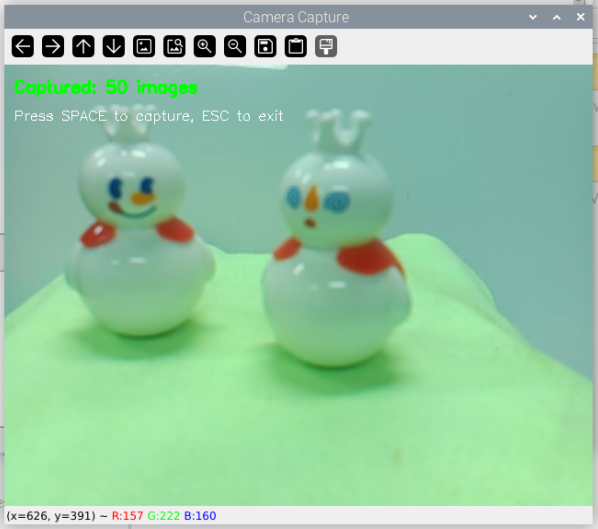

**Aufnehmen von Fotos mit der Raspberry-Pi-Kamera**

Hier ist der Code zum Aufnehmen von Fotos mit der Raspberry-Pi-Kamera:

.. code-block:: bash

   cd ~/ai-lab-kit/yolo
   python3 yolo_capture_images.py

.. code-block:: python

   #!/usr/bin/env python3
   """
   Einfaches Kameraaufnahmeskript für den Raspberry Pi
   Drücken Sie LEERTASTE zum Aufnehmen, ESC zum Beenden
   Bilder werden in ./captured_images/ gespeichert
   """

   from picamera2 import Picamera2
   import cv2
   import os
   import time

   # Erstelle das Speicherverzeichnis
   save_dir = "captured_images"
   os.makedirs(save_dir, exist_ok=True)

   # Kamera initialisieren
   picam2 = Picamera2()
   picam2.preview_configuration.main.size = (640, 480)
   picam2.preview_configuration.main.format = "RGB888"
   picam2.configure("preview")
   picam2.start()

   # Warten, bis die Kamera bereit ist
   time.sleep(1)

   print("=== Kamera-Aufnahmewerkzeug ===")
   print(f"Bilder werden gespeichert in: {save_dir}")
   print("Bedienung:")
   print("  LEERTASTE - Bild aufnehmen")
   print("  ESC       - Beenden")
   print("==============================")

   count = 0

   try:
      while True:
         # Einzelbild erfassen
         frame = picam2.capture_array()
         
         # Bild mit Anweisungen anzeigen
         display = frame.copy()
         cv2.putText(display, f"Aufgenommene Bilder: {count}", (10, 30),
                     cv2.FONT_HERSHEY_SIMPLEX, 0.6, (0, 255, 0), 2)
         cv2.putText(display, "Drücken Sie LEERTASTE zum Aufnehmen, ESC zum Beenden", (10, 60),
                     cv2.FONT_HERSHEY_SIMPLEX, 0.5, (255, 255, 255), 1)
         
         cv2.imshow("Kamera-Aufnahme", display)
         
         # Auf Tastendruck warten
         key = cv2.waitKey(1) & 0xFF
         
         if key == 32:  # LEERTASTE
               # Bild speichern
               filename = f"{save_dir}/img_{count:04d}.jpg"
               cv2.imwrite(filename, frame)
               print(f"Aufgenommen: {filename}")
               count += 1
               
               # Optional: Blitzeffekt
               flash = frame.copy()
               flash[:] = (255, 255, 255)
               cv2.imshow("Kamera-Aufnahme", flash)
               cv2.waitKey(50)
               
         elif key == 27:  # ESC-Taste
               print(f"\nBeende. Insgesamt aufgenommen: {count} Bilder")
               break

   finally:
      cv2.destroyAllWindows()
      picam2.stop()
      print("Kamera gestoppt")

**Übertragen von Bildern auf Ihren Computer**

Verwenden Sie nach der Aufnahme :ref:`filezilla`, um die Bilder vom Raspberry Pi auf Ihren Computer herunterzuladen:

1. Überprüfen Sie die IP-Adresse auf Ihrem Raspberry Pi: ``hostname -I``
2. Verbinden Sie sich in FileZilla mit dem Raspberry Pi (Benutzername: pi, Passwort: Ihr Passwort)
3. Navigieren Sie zum Verzeichnis ``~/ai-lab-kit/yolo/captured_images/``
4. Laden Sie alle Bilder auf Ihren Computer herunter

----------------------------------------------------------

Trainieren des Modells
-------------------------------------------------

Wir werden die Online-`Ultralytics-Plattform <https://platform.ultralytics.com/>`_ verwenden. Diese Plattform bietet bequeme Modelltrainingsdienste, ohne dass komplexe Trainingsumgebungen konfiguriert werden müssen.

**Registrierung und Anmeldung**

1. Klicken Sie oben rechts auf **Get started**, um zur Registrierungsseite zu gelangen, und schließen Sie den Anmeldevorgang ab.

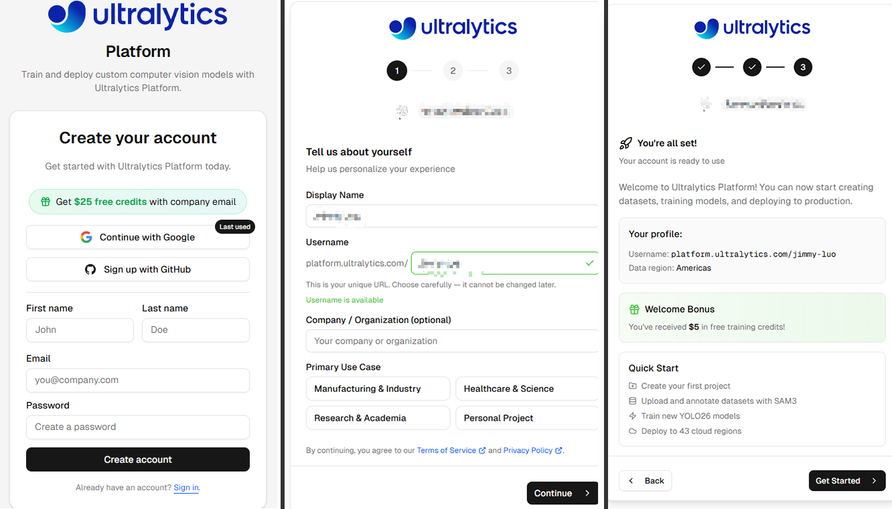

**Erstellen eines Datensatzes**

2. Nach der Registrierung werden Sie zur Startseite weitergeleitet. Klicken Sie auf **New Dataset**, um einen neuen Datensatz zu erstellen.

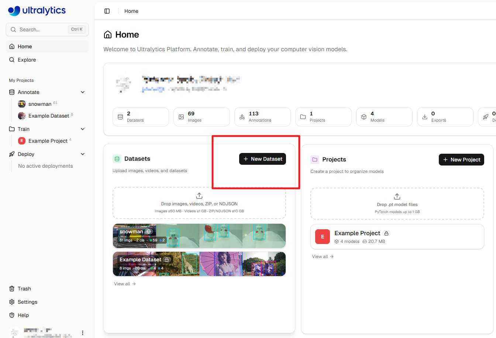

3. Ein Fenster wird geöffnet. Hier können Sie die gerade mit Ihrem Raspberry Pi aufgenommenen Fotos hochladen und einen **Datensatznamen** eingeben. Klicken Sie dann auf **Create & upload**.

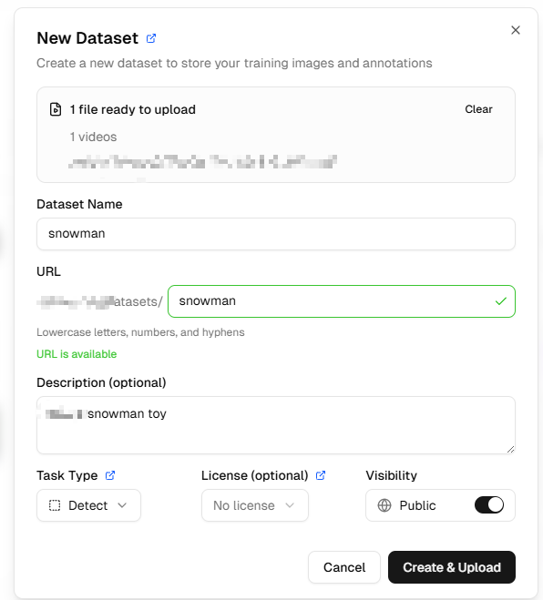

4. Sie gelangen nun in die Datensatzoberfläche, wo Sie alle hochgeladenen Bilder sehen können.

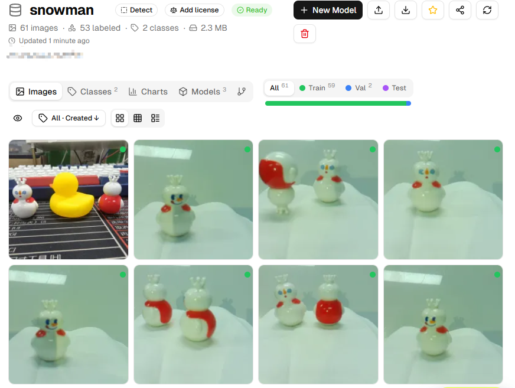

**Bilder annotieren**

5. Öffnen Sie jedes Foto, um es zu annotieren. Verwenden Sie die Schaltfläche **+Add Class** auf der rechten Seite, um Kategorien hinzuzufügen. Fügen Sie den passenden Kategorienamen basierend auf dem Objekt hinzu, das Sie identifizieren möchten (zum Beispiel: wenn Sie eine Tasse erkennen möchten, fügen Sie „cup“ hinzu; wenn Sie ein Haustier erkennen möchten, fügen Sie „pet“ hinzu).

   **Tipps zur Annotation**:
   - Zeichnen Sie mit der Maus Begrenzungsrahmen um Objekte und halten Sie diese so nah wie möglich an den Objektkanten
   - Stellen Sie sicher, dass jedes Objekt korrekt annotiert ist
   - Wenn ein Bild keine Zielobjekte enthält, ist keine Annotation erforderlich

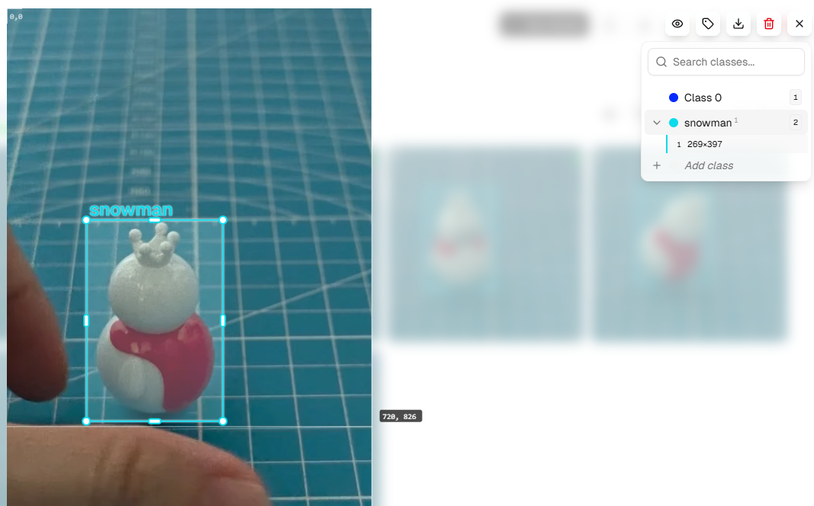

6. Wiederholen Sie die obigen Schritte, bis alle Fotos annotiert sind. Überprüfen Sie, ob die Annotationen in jedem Bild korrekt sind.

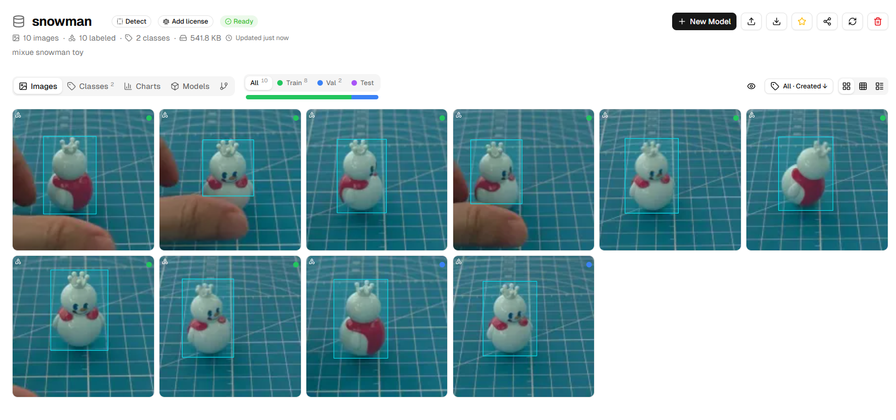

**Erstellen eines Trainingsmodells**

7. Klicken Sie auf **Models** und dann auf **New Model**.

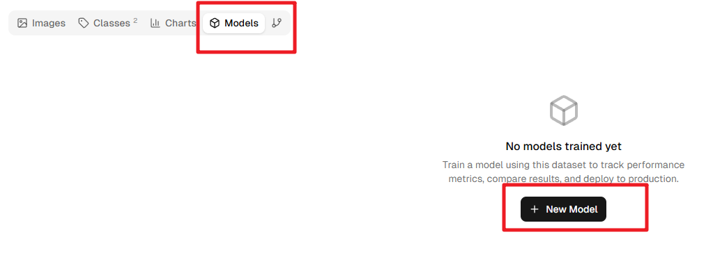

8. Wählen Sie im Popup-Fenster **YOLOv8n** oder **YOLO11n** als **Base Model**. Dies sind Nano-Versionen, die für den Raspberry Pi geeignet sind, klein und schnell.

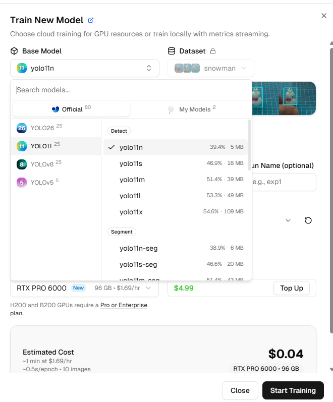

9. Konfigurieren Sie die Trainingsparameter:

   - **Image size**: Wählen Sie **320** (dies ist die Bildgröße, die der Raspberry Pi effizient verarbeiten kann)
   - **Epochs**: Behalten Sie die Standardeinstellung bei (typischerweise 50-100 Epochen)
   - **GPU Type**: Keine spezifische Anforderung, aber verschiedene GPU-Typen beeinflussen Trainingsgeschwindigkeit und -kosten
   
   **Hinweis**: Neue Ultralytics-Konten erhalten 5 $ Startguthaben; das Training eines kleinen Modells kostet normalerweise nur wenige Cent – nutzen Sie es nach Bedarf.

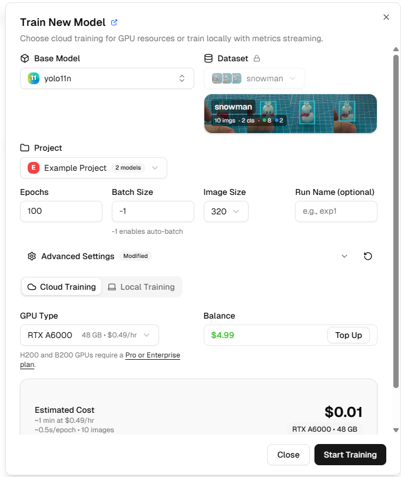

10. Klicken Sie auf **Start Training**. Warten Sie eine Weile (normalerweise 10-30 Minuten, abhängig von der Datenmenge und der GPU), und das Modell wird das Training abschließen.

    Während des Trainings können Sie Echtzeitmetriken sehen:
    
    - **box_loss**: Verlust des Begrenzungsrahmens; kleinere Werte sind besser
    - **cls_loss**: Klassifizierungsverlust; kleinere Werte sind besser
    - **mAP**: Mittlere durchschnittliche Präzision; höhere Werte sind besser (Bereich 0-1)

**Herunterladen und Bereitstellen**

11. Nach Abschluss des Trainings klicken Sie auf **Download PyTorch Model**, um das trainierte Modell herunterzuladen (es wird eine .pt-Datei sein).

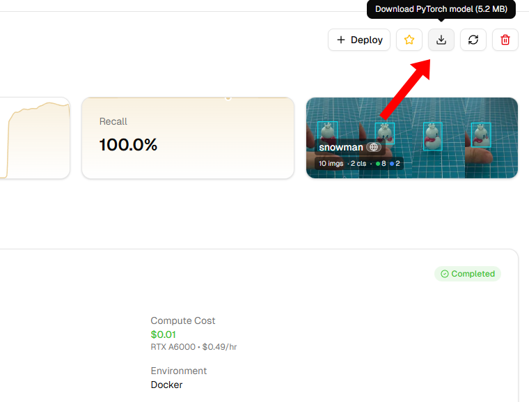

12. Übertragen Sie es nach dem Herunterladen mit FileZilla auf Ihren Raspberry Pi (empfohlen wird das Verzeichnis ``~/ai-lab-kit/yolo/``).

**Ausführen des benutzerdefinierten Modells**

Nachdem Sie das Modell auf Ihren Raspberry Pi übertragen haben, müssen Sie den Modellpfad im Beispielcode ändern. Hier ist ein vollständiges Ausführungsbeispiel:

.. code-block:: bash

   cd ~/ai-lab-kit/yolo
   nano yolo_custom.py

Ersetzen Sie den Modellnamen durch Ihre eigene heruntergeladene Datei:

.. code-block:: python
   :emphasize-lines: 6

   #!/usr/bin/env python3
   import cv2
   from picamera2 import Picamera2
   from ultralytics import YOLO

   model = YOLO("your_model.pt")  # Ersetzen Sie dies mit Ihrem Modellnamen

   # Kamera initialisieren
   picam2 = Picamera2()
   picam2.preview_configuration.main.size = (640, 480)
   picam2.preview_configuration.main.format = "RGB888"
   picam2.configure("preview")
   picam2.start()

   print("YOLO gestartet, drücken Sie 'q' zum Beenden...")

   try:
      while True:
         # Einzelbild erfassen
         frame = picam2.capture_array()
         
         # YOLO ausführen und imgsz=320 setzen
         results = model(frame, imgsz=320)
         
         # Ergebnisse zeichnen
         annotated = results[0].plot()
         
         # Ergebnisse anzeigen
         cv2.imshow("YOLO auf dem Raspberry Pi", annotated)
         
         # 'q' zum Beenden drücken
         if cv2.waitKey(1) & 0xFF == ord('q'):
               break
   finally:
      cv2.destroyAllWindows()
      picam2.stop()
      print("Beendet")

**Ergebnisse überprüfen**

13. Führen Sie den Beispielcode aus, um zu beobachten, wie das YOLO-Modell auf Ihrem Raspberry Pi abschneidet:

    .. code-block:: bash
    
       python3 yolo_custom.py

    Wenn alles korrekt funktioniert, sollten Sie Ihr trainiertes Zielobjekt im Kamerabild sehen, das von einem Begrenzungsrahmen umgeben ist, wobei der Kategoriename und der Konfidenzwert angezeigt werden.

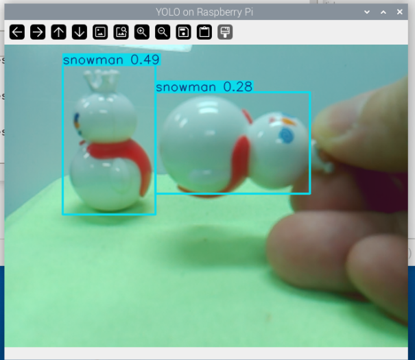

Herzlichen Glückwunsch! Sie haben erfolgreich Ihr eigenes YOLO-Modell trainiert und auf dem Raspberry Pi bereitgestellt.

----------------------------------------------------------

Tipps und Empfehlungen zum Training
-------------------------------------------------

**Verbesserung der Modellleistung**

* **Erhöhen Sie die Datenmenge**: Streben Sie mindestens 50-100 Bilder pro Kategorie an
* **Datenanreicherung**: Variieren Sie proaktiv Winkel, Abstände und Beleuchtung während der Aufnahme
* **Negative Beispiele**: Fügen Sie einige Bilder ohne Zielobjekte hinzu, um falsch-positive Ergebnisse zu reduzieren
* **Ausgewogener Datensatz**: Wenn Sie mehrere Kategorien identifizieren, stellen Sie ähnliche Bildanzahlen für jede Kategorie sicher

Häufige Fragen
-------------------------

**Was tun, wenn die Modellerkennungsergebnisse unbefriedigend sind?**

- Überprüfen Sie die Genauigkeit der Annotationen
- Erhöhen Sie die Anzahl der Trainingsbilder
- Probieren Sie größere Modelle (wie YOLOv8s) oder mehr Trainingsepochen aus
- Nehmen Sie mehr Bilder aus verschiedenen Szenarien auf

**Wie lange dauert das Training?**

- Mit etwa 50 Bildern und YOLOv8n dauert das Training typischerweise 10-20 Minuten
- Die Plattform passt sich automatisch basierend auf der ausgewählten GPU an

**Kann ich lokal trainieren?**

Ja, aber Sie müssen die Python-Umgebung und GPU-Treiber konfigurieren. Für Anfänger wird die Ultralytics-Plattform empfohlen, um Ideen schnell zu validieren.