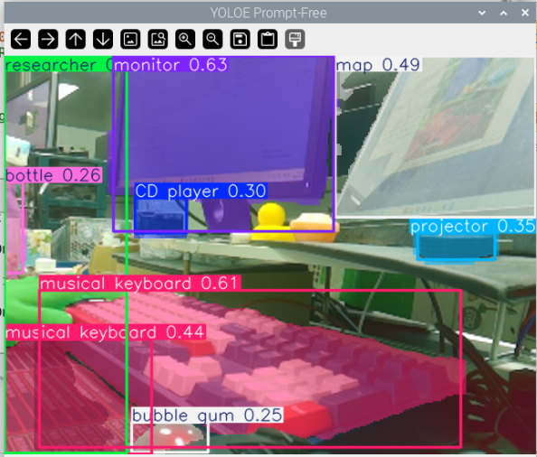
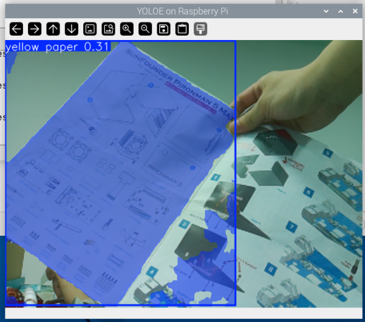

.. include:: /index.rst
   :start-after: start_hello_message
   :end-before: end_hello_message

2. Detecta Cualquier Cosa con YOLOE
===================================

YOLOE (You Only Look Once with Embeddings) es el miembro mas reciente de la familia YOLO, que introduce capacidades de aprendizaje conjunto lenguaje-vision al YOLO tradicional. En pocas palabras, YOLOE no solo puede detectar objetos con los que fue entrenado, sino que tambien puede detectar nuevos objetos arbitrarios a traves de descripciones de texto o indicaciones sin necesidad de reentrenamiento.

Caracteristicas clave de YOLOE:

* **Deteccion de vocabulario abierto**: Detecta objetos arbitrarios mediante descripciones de texto, sin limitarse a categorias predefinidas
* **Modo sin indicaciones**: Detecta automaticamente objetos sobresalientes en imagenes sin ninguna indicacion
* **Implementacion eficiente**: Hereda la arquitectura eficiente de YOLO, funciona sin problemas en Raspberry Pi
* **Soporte multitarea**: Admite diversas tareas, incluyendo deteccion de objetos y segmentacion de instancias

Esto hace que YOLOE sea particularmente adecuado para prototipos rapidos y aplicaciones que requieren deteccion flexible de diversos objetos.

Instalacion de Dependencias
---------------------------------------------------

Primero, instala la libreria CLIP requerida por YOLOE:

.. code-block:: bash

   pip3 install git+https://github.com/ultralytics/CLIP.git --break-system-packages

Modo Sin Indicaciones
-----------------------------

El modo sin indicaciones es la forma mas intuitiva de usar YOLOE. En este modo, el modelo detecta automaticamente todos los objetos sobresalientes en la imagen sin ninguna indicacion de texto. Se comporta de manera similar al YOLO tradicional pero con mejores capacidades de vocabulario abierto.

Figura: Apunte la camara hacia mi escritorio desordenado, y el modo sin indicaciones de YOLOE identifico y segmento automaticamente todos los objetos sobresalientes a la vista: monitor, teclado, vaso de agua, cuaderno, raton... Cada objeto esta anotado con una mascara de segmentacion de color diferente, sin requerir ninguna indicacion de texto. Todo se presenta claramente de un vistazo.

**Como funciona**: El modelo identifica automaticamente objetos en primer plano en la imagen a traves del analisis de caracteristicas visuales y realiza la segmentacion. Este enfoque es adecuado para navegar rapidamente por el contenido de la imagen o cuando no estas seguro de que objetos necesitan ser detectados.

El siguiente codigo demuestra como ejecutar YOLOE en modo sin indicaciones en una Raspberry Pi:

.. code-block:: bash

   cd ~/ai-lab-kit/yolo
   python3 yoloe_prompt_free.py

.. code-block:: python

   from ultralytics import YOLO
   from picamera2 import Picamera2
   import cv2

   # prompt-free mode
   model = YOLO("yoloe-11s-seg-pf.pt")  # pf = prompt-free

   picam2 = Picamera2()
   picam2.preview_configuration.main.size = (640, 480)
   picam2.preview_configuration.main.format = "RGB888"
   picam2.configure("preview")
   picam2.start()

   print("Prompt-free mode: detecting everything automatically...")
   print("Press 'q' to exit")

   while True:
      frame = picam2.capture_array()
      results = model.predict(frame, imgsz=320)
      annotated = results[0].plot()
      cv2.imshow("YOLOE Prompt-Free", annotated)

      if cv2.waitKey(1) & 0xFF == ord('q'):
         break

   cv2.destroyAllWindows()
   picam2.stop()

**Caracteristicas del Modo Sin Indicaciones**:

* **Sin configuracion necesaria**: Ejecuta directamente para detectar objetos sobresalientes en imagenes
* **Segmentacion automatica**: Genera tanto cuadros de deteccion como mascaras de segmentacion
* **Sin etiquetas de clase**: Solo muestra las ubicaciones de los objetos detectados sin nombres de categoria
* **Casos de uso**: Navegacion rapida, deteccion general de objetos, descubrimiento de objetos desconocidos

Modo de Indicaciones de Texto
----------------------------------

El modo de indicaciones de texto es donde el poder de YOLOE realmente brilla. A traves de descripciones en lenguaje natural, puedes decirle al modelo que objetos detectar, y el modelo identificara y localizara estos objetos en tiempo real.

Figura: Sostuve un trozo de papel que era mitad amarillo y mitad blanco frente a la camara, y use una indicacion de texto para decirle al modelo que buscara "papel amarillo". YOLOE entendio con precision esta descripcion, segmentando solo la mitad amarilla del papel y marcandola con un cuadro delimitador, mientras ignoraba por completo la porcion blanca. Esto demuestra la capacidad de YOLOE para realizar reconocimiento de objetos detallado a traves del lenguaje natural.

**Como funciona**: El modelo codifica las indicaciones de texto en vectores de caracteristicas, luego las compara con las caracteristicas de la imagen para identificar regiones que mejor se corresponden con las descripciones de texto. Este enfoque te permite especificar objetivos de deteccion de forma dinamica sin reentrenar el modelo.

El siguiente codigo demuestra como usar indicaciones de texto para detectar objetos especificos:

.. code-block:: bash

   cd ~/ai-lab-kit/yolo
   python3 yoloe_prompt_text.py

.. code-block:: python

   from ultralytics import YOLOE
   from picamera2 import Picamera2
   import cv2

   # load YOLOE model
   model = YOLOE("yoloe-26n-seg.pt")  # nano version

   # set the classes to detect (text prompt)
   names = ["yellow paper", "red cup", "person wearing glasses"]
   model.set_classes(names, model.get_text_pe(names))

   # initialize the camera
   picam2 = Picamera2()
   picam2.preview_configuration.main.size = (640, 480)
   picam2.preview_configuration.main.format = "RGB888"
   picam2.configure("preview")
   picam2.start()

   print("YOLOE running with text prompts, press 'q' to exit...")
   print(f"Detecting: {', '.join(names)}")

   while True:
      frame = picam2.capture_array()
      results = model.predict(frame, conf=0.3)  # set confidence threshold to 0.3
      annotated = results[0].plot()
      cv2.imshow("YOLOE on Raspberry Pi", annotated)

      if cv2.waitKey(1) & 0xFF == ord('q'):
         break

   cv2.destroyAllWindows()
   picam2.stop()

**Caracteristicas del Modo de Indicaciones de Texto**:

* **Deteccion dinamica**: Modifica los objetivos de deteccion en cualquier momento sin reentrenar
* **Lenguaje natural**: Usa lenguaje cotidiano para describir objetos, como "auto azul", "silla de madera"
* **Deteccion multiobjetivo**: Especifica multiples objetivos de deteccion a la vez
* **Control detallado**: Describe atributos como color, material, forma, etc.
* **Umbral de confianza**: Controla la sensibilidad de deteccion a traves del parametro ``conf``

Uso Avanzado
-------------------------------------

**Cambio Dinamico de Objetivos de Deteccion**

Puedes modificar las indicaciones de texto en tiempo de ejecucion sin reiniciar el programa:

.. code-block:: python

   # Initialize model
   model = YOLOE("yoloe-26n-seg.pt")

   # Initial detection targets
   current_names = ["red apple"]
   model.set_classes(current_names, model.get_text_pe(current_names))

   while True:
      frame = picam2.capture_array()

      # Check if detection target needs to be switched
      key = cv2.waitKey(1) & 0xFF
      if key == ord('1'):
         current_names = ["banana"]
         model.set_classes(current_names, model.get_text_pe(current_names))
         print("Now detecting: banana")
      elif key == ord('2'):
         current_names = ["orange"]
         model.set_classes(current_names, model.get_text_pe(current_names))
         print("Now detecting: orange")

      results = model.predict(frame, conf=0.3)
      annotated = results[0].plot()
      cv2.imshow("YOLOE", annotated)

      if key == ord('q'):
         break

**Usar Descripciones de Texto Mas Complejas**

YOLOE admite descripciones complejas en lenguaje natural para una localizacion de objetos mas precisa:

.. code-block:: python

   # More precise description examples
   names = [
       "person wearing a red hat",
       "car with open door",
       "small dog on the left side",
       "yellow paper on the desk"
   ]
   model.set_classes(names, model.get_text_pe(names))

**Ajustar Parametros de Deteccion**

Optimizacion de rendimiento para Raspberry Pi:

.. code-block:: python

   # Performance optimization configuration
   results = model.predict(
       frame,
       imgsz=224,        # Lower resolution for faster speed
       conf=0.4,         # Higher confidence threshold reduces false positives
       iou=0.5,          # Adjust IOU threshold
       verbose=False     # Disable verbose output
   )

Consejos de Optimizacion de Rendimiento
-------------------------------------------------

Al ejecutar YOLOE en Raspberry Pi, las siguientes optimizaciones pueden ayudar a lograr un mejor rendimiento:

1. **Elige el modelo adecuado**:

   - ``yoloe-26n-seg.pt``: Version nano, maxima velocidad
   - ``yoloe-11s-seg-pf.pt``: Version S, mayor precision pero mas lenta

2. **Reduce la resolucion de entrada**:

   - ``imgsz=224``: Maxima velocidad
   - ``imgsz=320``: Opcion equilibrada (recomendada)
   - ``imgsz=416``: Mayor precision

3. **Ajusta el umbral de confianza**:

   - Aumentar el parametro ``conf`` (por ejemplo, a 0.5) reduce el numero de detecciones y mejora la velocidad

4. **Reduce las categorias de deteccion**:

   - En el modo de indicaciones de texto, limitar la longitud de la lista ``names`` puede mejorar la velocidad de inferencia

Preguntas Frecuentes
-------------------------

**P: ¿Cual es la diferencia entre YOLOE y el YOLO tradicional?**

R: El YOLO tradicional solo puede detectar categorias fijas definidas durante el entrenamiento, mientras que YOLOE puede detectar objetos arbitrarios a traves de indicaciones de texto sin reentrenamiento.

**P: ¿El modo sin indicaciones detecta todos los objetos?**

R: El modo sin indicaciones detecta objetos visualmente sobresalientes en la imagen pero no proporciona etiquetas de categoria, lo que lo hace adecuado para explorar escenas rapidamente.

**P: ¿La indicacion de texto admite espanol?**

R: Se recomiendan indicaciones en ingles para obtener los mejores resultados, ya que el modelo esta entrenado principalmente con datos en ingles.

**P: ¿Cual es la velocidad de ejecucion de YOLOE en Raspberry Pi?**

R: En Raspberry Pi 5, usando el modelo nano con resolucion 320, puedes lograr un rendimiento en tiempo real de 3-5 FPS.

**P: ¿Puedo usar multiples indicaciones de texto simultaneamente?**

R: Si, simplemente agrega multiples descripciones a la lista ``names``, y el modelo detectara todos estos objetos simultaneamente.
